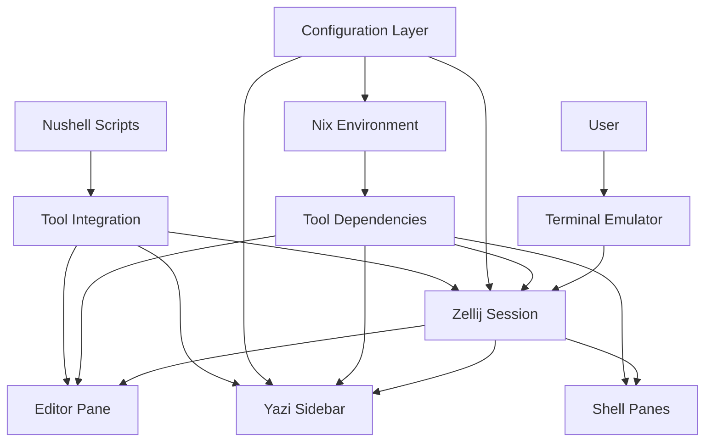

# Design Document

## Overview

Yazelix is a terminal workspace system that provides an IDE-like experience by integrating three core tools: Yazi (file manager), Zellij (terminal multiplexer), and Helix (text editor). The system is built on Nix for reproducible environments and uses Nushell for automation and integration scripts.

The architecture follows a layered approach where Nix manages dependencies, Nushell handles integration logic, and configuration files provide customization points. The system supports multiple shells, editors, and terminal emulators while maintaining seamless integration between components.

## Architecture

### High-Level Architecture



### Component Architecture

The system is organized into several key components:

1. **Nix Environment Management**: Handles dependency resolution, environment setup, and reproducible builds
2. **Configuration System**: Multi-layered configuration with defaults, overrides, and user customization
3. **Integration Scripts**: Nushell-based automation for tool coordination and workflow management
4. **Shell Integration**: Cross-shell compatibility with automatic initialization
5. **Layout Management**: Dynamic workspace layouts for different development scenarios

### Dependency Management

Yazelix uses Nix flakes for dependency management with the following structure:

- **Essential Dependencies**: Always installed (Zellij, Yazi, Helix, Nushell, Bash, fzf, zoxide, starship, macchina, libnotify, mise)
- **Extra Shell Dependencies**: Installed based on user configuration (fish, zsh)
- **Recommended Dependencies**: Productivity tools (lazygit, atuin, carapace, markdown-oxide)
- **Yazi Extensions**: Lightweight tools for enhanced Yazi functionality (p7zip, jq, fd, ripgrep, poppler)
- **Yazi Media**: Heavy media processing tools (~800MB-1.2GB) (ffmpeg, imagemagick, etc.)
- **Package Packs**: Grouped by functionality (python pack, js_ts pack, rust pack, config pack, file-management pack)

## Components and Interfaces

### Configuration Parser

**Purpose**: Parse and validate yazelix.nix configuration files
**Location**: `nushell/scripts/utils/config_parser.nu`

**Interface**:
```nushell
export def parse_yazelix_config [] -> record
```

**Responsibilities**:
- Parse yazelix.nix using line-based parsing
- Extract configuration values with defaults
- Handle missing or invalid configurations gracefully
- Support both yazelix.nix and yazelix_default.nix

### Environment Setup

**Purpose**: Initialize the Yazelix environment and dependencies
**Location**: `nushell/scripts/setup/environment.nu`

**Interface**:
```nushell
def main [
    yazelix_dir: string
    recommended: bool
    build_helix_from_source: bool
    default_shell: string
    debug_mode: bool
    extra_shells_str: string
    skip_welcome_screen: bool
    helix_mode: string
    ascii_art_mode: string
    show_macchina_on_welcome: bool
]
```

**Responsibilities**:
- Detect environment type (standard, home-manager, read-only)
- Create user configuration from template if needed
- Setup shell configurations for all configured shells
- Generate shell initializers for productivity tools
- Handle logging and welcome screen display

### Shell Initializer Generator

**Purpose**: Generate initialization scripts for productivity tools across all shells
**Location**: `nushell/scripts/setup/initializers.nu`

**Interface**:
```nushell
def main [yazelix_dir: string, recommended: bool, shells_to_configure_str: string]
```

**Responsibilities**:
- Generate init scripts for Starship and Zoxide (required) and Mise and Carapace (recommended)
- Support bash, fish, zsh, and nushell shells
- Handle missing recommended tools gracefully
- Use XDG-compliant directories for storage

### Zellij Configuration Merger

**Purpose**: Dynamically merge three layers of Zellij configuration
**Location**: `nushell/scripts/setup/zellij_config_merger.nu`

**Interface**:
```nushell
export def generate_merged_zellij_config [yazelix_dir: string] -> string
```

**Responsibilities**:
- Fetch Zellij defaults dynamically
- Merge with Yazelix overrides
- Apply user personal configuration with highest priority
- Copy layout files to merged configuration directory
- Regenerate when source files change

### Tool Integration Scripts

**Purpose**: Coordinate between Yazi, Zellij, and editors
**Location**: `nushell/scripts/integrations/`

**Key Scripts**:
- `open_file.nu`: Open files from Yazi in editor with intelligent pane detection
- `reveal_in_yazi.nu`: Reveal current editor file in Yazi sidebar
- `focus_helix.nu`: Focus and move Helix pane to top of stack
- `open_dir_in_pane.nu`: Open directories in new Zellij panes

**Responsibilities**:
- Implement bidirectional navigation between tools
- Handle intelligent pane detection and reuse
- Manage focus and window arrangement
- Provide consistent integration regardless of editor choice

### Command Suite

**Purpose**: Provide unified command interface for Yazelix management
**Location**: `nushell/scripts/core/yazelix.nu`

**Interface**:
```nushell
export def yzx [] # Main command with subcommands
export def "yzx help" []
export def "yzx config_status" [shell?: string]
export def "yzx versions" []
export def "yzx info" []
export def "yzx launch" []
export def "yzx start" []
export def "yzx restart" []
```

**Responsibilities**:
- Provide user-friendly command interface
- Show system status and configuration information
- Handle session management and launching
- Support both persistent and ephemeral sessions

## Data Models

### Configuration Schema

The yazelix.nix configuration follows this schema:

```nix
{
  # Dependency groups
  recommended_deps: bool;
  yazi_extensions: bool;
  yazi_media: bool;
  
  # Core settings
  helix_mode: "release" | "source";
  default_shell: "nu" | "bash" | "fish" | "zsh";
  extra_shells: [string];
  preferred_terminal: "ghostty" | "wezterm" | "kitty" | "alacritty";
  editor_command: string;
  helix_runtime_path: string | null;
  
  # UI settings
  enable_sidebar: bool;
  debug_mode: bool;
  skip_welcome_screen: bool;
  ascii_art_mode: "static" | "animated";
  show_macchina_on_welcome: bool;
  
  # Session management
  persistent_sessions: bool;
  session_name: string;
  
  # Package management
  packs: [string];
  user_packages: [package];
}
```

### Environment Detection

The system detects three environment types:

1. **Standard**: Normal user installation with read-write access
2. **Home Manager**: Managed by Home Manager with controlled configuration
3. **Read-only**: Limited permissions, possibly in managed environments

### Shell Configuration Structure

Each shell has its own configuration approach:

- **Bash**: Sources `yazelix_bash_config.sh` via .bashrc
- **Nushell**: Sources `config.nu` via user config.nu
- **Fish**: Sources `yazelix_fish_config.fish` via config.fish
- **Zsh**: Sources `yazelix_zsh_config.zsh` via .zshrc

## Error Handling

### Configuration Errors

- **Missing yazelix.nix**: Falls back to yazelix_default.nix
- **Invalid configuration values**: Uses sensible defaults with warnings
- **Parse errors**: Continues with defaults and logs errors

### Tool Integration Errors

- **Missing tools**: Graceful degradation with informative messages
- **Pane detection failures**: Falls back to creating new panes
- **File operation errors**: Logged with context for debugging

### Environment Errors

- **Read-only directories**: Warns user and continues with limited functionality
- **Missing dependencies**: Clear error messages with installation guidance
- **Permission issues**: Attempts to continue with available functionality

## Testing Strategy

### Unit Testing

- **Configuration parsing**: Test various yazelix.nix configurations
- **Shell integration**: Verify correct shell script generation
- **Tool detection**: Test pane detection logic with various scenarios

### Integration Testing

- **Cross-shell compatibility**: Test all supported shells
- **Tool coordination**: Verify Yazi-Editor-Zellij integration
- **Configuration merging**: Test Zellij configuration layer merging

### Environment Testing

- **Multiple platforms**: Test on different Linux distributions
- **Terminal emulators**: Verify compatibility with all supported terminals
- **Home Manager integration**: Test declarative configuration management

### Performance Testing

- **Startup time**: Measure and optimize initialization performance
- **Configuration generation**: Test with large configuration files
- **Log management**: Verify automatic log cleanup functionality

## Security Considerations

### File System Access

- Use XDG-compliant directories for configuration and state
- Validate file paths to prevent directory traversal
- Handle permission errors gracefully

### Shell Integration

- Sanitize shell commands and arguments
- Use proper quoting in generated shell scripts
- Validate user input in configuration files

### Nix Environment

- Pin dependency versions through flake.lock for reproducibility
- Pin specific versions directly in flake.nix when compatibility issues arise (e.g., nushell pinned for carapace compatibility)
- Use secure sources for all dependencies
- Validate flake inputs and outputs

## Performance Considerations

### Startup Optimization

- Cache generated configurations when possible
- Lazy-load optional components
- Minimize shell initialization overhead

### Resource Management

- Automatic cleanup of old log files
- Efficient configuration parsing
- Minimal memory footprint for integration scripts

### Scalability

- Support for large project directories
- Efficient file watching and updates
- Optimized pane detection algorithms