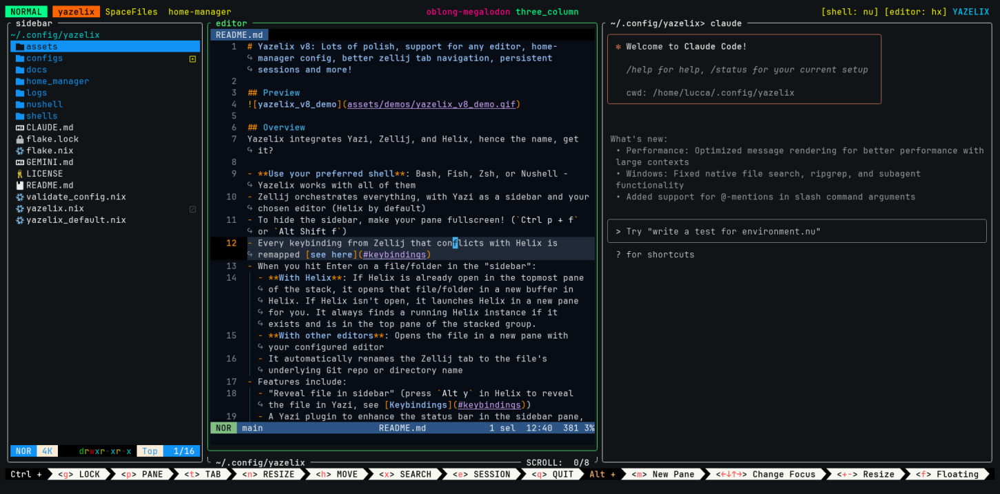

# Yazelix v11

<div align="center">
  
</div>

## Preview
**v8:**


**v8.5 with zjstatus:**


## Overview
Yazelix integrates Yazi, Zellij, and Helix (hence the name!), with first-class support for Neovim too.

- ⚠️ Yazelix now uses the devenv-based shell (`devenv.nix`) and `yazelix.toml`. The legacy flake interface (`flake.nix`, `yazelix.nix`) has been removed.

- **Use your preferred shell**: Bash, Fish, Zsh, or Nushell - Yazelix works with all of them
- Zellij orchestrates everything, with Yazi as a sidebar and your chosen editor (Helix by default)
- To hide the sidebar, make your pane fullscreen! (`Ctrl p + f` or `Alt Shift f`)
- Every keybinding from Zellij that conflicts with Helix is remapped [see here](#keybindings)
- When you hit Enter on a file/folder in the "sidebar":
  - **With Helix or Neovim**: Searches up to 4 panes for an existing editor instance. If found, moves it to the top and opens the file there. If not found, launches the editor in a new pane.
  - **With other editors**: Opens the file in a new pane with your configured editor
  - It automatically renames the Zellij tab to the file's underlying Git repo or directory name
- Features include:
  - "Reveal file in sidebar" (press `Alt y` in Helix/Neovim to reveal the file in Yazi, `Alt y` in Yazi to focus editor, see [Keybindings](#keybindings))
  - A Yazi plugin to enhance the status bar in the sidebar pane, making it uncluttered, colorful, and showing file permissions
  - A [Git plugin](https://github.com/yazi-rs/plugins/tree/main/git.yazi) showing file changes in the Yazi sidebar
  - Dynamic column updates in Yazi (parent, current, preview) via the [auto-layout plugin](https://github.com/luccahuguet/auto-layout.yazi), perfect for sidebar use
  - **Modular editor support**: Helix and Neovim have full integration features, or use any other editor via the `editor_command` setting
- This project includes config files for Zellij, Yazi, terminal emulators, Nushell scripts, Lua plugins, and a lot of love
- See [boot sequence](./docs/boot_sequence.md) for details on how Yazelix starts up

## Why Yazelix
Yazelix is a reproducible terminal IDE that integrates Yazi + Zellij + Helix. It delivers a consistent, fast “superterminal” locally or over SSH with zero manual setup: smart pane/layout orchestration, sidebar reveal/open flows, curated packs, and sane defaults. It also solves helix/zellij keybinding conflicts (no need to ever lock zellij), auto‑configures great tools like starship, zoxide, carapace (that normally require editing shell config files), and includes many tools from the Yazelix Collection, like lazygit

It already comes with cool zellij and yazi plugins, some of which I maintain myself

It has features like `reveal in Yazi` (from Helix or Neovim) and opening files from Yazi in your configured editor

Supports top terminals (Ghostty, WezTerm, Kitty, Alacritty) and popular shells (Bash, Zsh, Fish, Nushell). Easy to configure via a single Nix file with sensible defaults

Get everything running in less than 10 minutes. No extra dependencies, only Nix

Install once, get the same environment everywhere

## Vision
- Using the terminal should be easy, beautiful, practical and reproducible
- Good defaults over customization. Have both when possible
- Yazelix is always on the edge of project versions
- Yazelix is always evolving, it's a living being
- What is even Yazelix?
- Yazelix lets you say `I use Yazelix btw`
- Boy, do we Nix
- Integration, integration, integration
- Made with love.

## Acknowledgments
See [Yazelix Collection](./docs/yazelix_collection.md) for a full list of all projects, tools, and plugins Yazelix integrates, including links to each project and their homepages.

## Improvements in v12

- **User-Declared Packs** – Packs are defined in `packs.declarations` and enabled via `packs.enabled`, with refreshed presets (Rust/Go split, `jj` pack, simpler git, YAML support).
- **Yazi Upgrades** – Plugin system + theme/sorting controls, `init.lua`/`keymap.toml` merging, lazygit/starship integrations, bundled Yazi themes, and a documented cross-theme set shared by Zellij/Helix/Yazi.
- **Terminal** – Ordered terminal list, added `manage_terminals` option to disable Yazelix-managed terminal packages for system-installed terminals, automatic environment rebuilds before launch/restart on terminal config changes.
- **Zellij** – Pinned zjstatus with configurable widget tray (`zellij.widget_tray`) and per-item toggles.
- **Launch & Config** – Direct TOML config parsing, setup-only bootstrap option, modularized core commands, POSIX `sh` desktop launcher.
- **Nixpkgs Unstable** – Uses unstable for all packages.
- **Updates & UX** – Smarter update suite: `yzx update devenv|lock|zjstatus|repo|all`, cleaner lock refresh, sweep robustness, extensive bug fixes, and better warnings/compat fixes.

Full version history: [Version History](./docs/history.md)

## Compatibility
- **Platform**: Works on Linux and macOS
- **Terminal**: Ghostty (via Homebrew on macOS), Kitty, WezTerm, Alacritty; Foot on Linux only
- **Editor**: Any editor works! Helix and Neovim have first-class support (reveal in sidebar, open buffer in running instance, pane detection). Configure via `editor_command` setting in `yazelix.toml`
- **Shell**: Bash, Fish, Zsh, or Nushell - use whichever you prefer
- See the version compatibility table [here](./docs/version_table.md) (generated dynamically!)

## Installation

📖 **[Complete Installation Guide →](./docs/installation.md)** - Detailed step-by-step setup instructions

### Helix Integration
For Helix-Yazi integration, add this to your Helix config (`~/.config/helix/config.toml`):

```toml
[keys.normal]
# Yazelix sidebar integration - reveal current file in Yazi sidebar
A-y = ":sh nu ~/.config/yazelix/nushell/scripts/integrations/reveal_in_yazi.nu \"%{buffer_name}\""
```

📖 **[Complete Helix Keybindings Guide →](./docs/helix_keybindings.md)** - Recommended keybindings for enhanced editing experience

### Neovim Integration
For Neovim-Yazi integration, add this to your Neovim config (`~/.config/nvim/init.lua`):

```lua
-- Yazelix sidebar integration - reveal current file in Yazi sidebar
vim.keymap.set('n', '<M-y>', function()
  local buffer_path = vim.fn.expand('%:p')
  if buffer_path ~= '' then
    vim.fn.system('nu ~/.config/yazelix/nushell/scripts/integrations/reveal_in_yazi.nu "' .. buffer_path .. '"')
  end
end, { desc = 'Reveal in Yazi sidebar' })
```

📖 **[Complete Neovim Keybindings Guide →](./docs/neovim_keybindings.md)** - Setup instructions and workflow tips

## Version Check
Check installed tool versions:
```bash
nu nushell/scripts/utils/version_info.nu
```

## Editor Pane Detection Logic

When opening files from Yazi, Yazelix will:
- Check the topmost pane and up to 3 panes below for a Zellij pane named `editor` (works for both Helix and Neovim).
- If your editor is found, it is moved to the top and reused; if not, a new editor pane is opened.
- This is needed because when opening or closing Zellij panes in the stack, the editor pane can move around (often down by 2 positions).
- Supports both Helix and Neovim with identical behavior - configure via `editor_command` in `yazelix.toml`.

## Version History & Changelog

For a detailed history of all major Yazelix version bumps and changelogs, see [Version History](./docs/history.md).

## POSIX/XDG Paths

Yazelix respects XDG directories for config, data, state, and cache. See POSIX/XDG Paths for details: ./docs/posix_xdg.md

## SSH / Remote

Yazelix shines over SSH: the TUI stack (Zellij, Yazi, Helix) runs cleanly without any GUI, giving you a fully configured, consistent “superterminal” on barebones hosts (for example, an AWS EC2 instance). The flake delivers the same tools, keybindings, and layouts you use locally, minimizing drift on ephemeral servers.

## Customization & Configuration

Yazelix uses a **layered configuration system** that safely merges your personal settings with Yazelix defaults:

- **Core settings**: Edit `~/.config/yazelix/yazelix.toml` for shell, editor, terminal, and package preferences
- **Yazi customization**: Configure plugins, theme, and sorting in `yazelix.toml` under the `[yazi]` section (see [Yazi Configuration](./docs/yazi-configuration.md))
- **Zellij customization**: Add personal overrides in `configs/zellij/personal/` directory
- **Your configs persist** across Yazelix updates without git conflicts
- **Intelligent merging**: TOML sections merge properly, avoiding duplicate keys and conflicts

📖 **[Complete Customization Guide →](./docs/customization.md)** - Detailed instructions for customizing every tool

### Editor Configuration

📝 **[Editor Configuration Guide →](./docs/editor_configuration.md)** - Complete guide for configuring editors

**Quick setup:**
- **Default (recommended)**: `editor_command = null` - Uses yazelix's Helix, no conflicts, full integration
- **Neovim**: `editor_command = "nvim"` - Full integration (reveal in sidebar, same-instance opening, pane detection)
- **System Helix**: `editor_command = "hx"` - Requires matching `helix_runtime_path`, full integration
- **Other editors**: `editor_command = "vim"` - Basic integration (file opening, tab naming only)

### Alternative: CLI-Only Mode
To use Yazelix tools without starting the full interface (no sidebar, no Zellij), use:
```bash
yzx env
```
This loads all tools (helix, yazi, lazygit, etc.) into your current shell, with Yazelix env vars set and clean messaging, and automatically launches the shell configured in your `yazelix.toml`. Prefer the legacy behavior? Run `yzx env --no-shell` to stay in your current shell.

If you prefer a raw environment shell without launching Yazelix, you can use:
```bash
devenv shell
```

### Packages & Customization

**What Gets Installed:**
See the full catalog of tools and integrations in the Yazelix Collection:
[docs/yazelix_collection.md](./docs/yazelix_collection.md).
- **Essential tools**: [Yazi](https://github.com/sxyazi/yazi) (file manager), [Zellij](https://github.com/zellij-org/zellij) (terminal multiplexer), [Helix](https://helix-editor.com) (editor), shells (bash/nushell, plus your preferred shell), [fzf](https://github.com/junegunn/fzf), [zoxide](https://github.com/ajeetdsouza/zoxide), [Starship](https://starship.rs)
- **Recommended tools** (enabled by default): [lazygit](https://github.com/jesseduffield/lazygit) (or `lg`), [mise](https://github.com/jdx/mise), [cargo-update](https://github.com/nabijaczleweli/cargo-update), [ouch](https://github.com/ouch-org/ouch), etc
- **Optional history**: [atuin](https://github.com/atuinsh/atuin) integration is now controlled by `enable_atuin` (disabled by default).
- **Yazi extensions** (enabled by default): `p7zip`, `jq`, `poppler`, `fd`, `ripgrep` (for archives, search, document previews)
- **Yazi media extensions** (disabled by default): `ffmpeg`, `imagemagick` (for media previews - ~1GB)
- **Environment setup**: Proper paths, variables, and shell configurations

**Customize Your Installation:**
If you followed [step 4 in the installation guide](./docs/installation.md#step-4-configure-your-installation-optional), you already have your `~/.config/yazelix/yazelix.toml` config file ready! You can modify it anytime and restart Yazelix to apply changes. See [yazelix_default.toml](./yazelix_default.toml) for all available options and their descriptions.

**Terminal Emulator Selection:**
- **Ghostty** (default): Modern, fast terminal written in Zig with great performance
  - **Linux**: Provided by Yazelix via Nix
  - **macOS**: Install via Homebrew: `brew install --cask ghostty` (Nix doesn't support macOS app bundles)
- **WezTerm** (recommended fallback): Works on both platforms via Nix, best image preview support in Yazi
- **Kitty**: Fast, feature-rich, GPU-accelerated terminal (works on both platforms)
- **Alacritty**: Fast, GPU-accelerated terminal written in Rust
- **Foot**: Wayland-native terminal (Linux-only)
- **Auto-detection**: Fallback order follows your configured terminal list
- Configure your preference in `yazelix.toml` with `terminals = ["ghostty", "wezterm", ...]` (first item is primary)
- **Managed terminals**: Set `manage_terminals = true` to install wrappers and terminal packages via Nix. Set it to false to use system-installed terminals only.

[See the full Customization Guide here.](./docs/customization.md)

---

## Home Manager Integration

Yazelix includes optional Home Manager support for declarative configuration management. See [home_manager/README.md](home_manager/README.md) for setup instructions.

## Notes
- `devenv shell` automatically passes through the HOME environment variable, so Yazelix can resolve user-specific paths without extra flags
- Tweak configs to make them yours; this is just a starting point! 
- For extra configuration, see: [WezTerm Docs](https://wezfurlong.org/wezterm/config/files.html)
- Add more swap layouts as needed using the KDL files in `configs/zellij/layouts`
- Use `lazygit`, it's great

## When should you not use yazelix?
- If you hate having fun
- If you suffer from a severe case of nix-allergy

## Initializer Scripts
Yazelix auto-generates initialization scripts for Starship, Zoxide, Mise, and Carapace for your configured default shell, regenerated every startup. See [docs/initializer_scripts.md](./docs/initializer_scripts.md) for details.

## yzx Command Line Interface

🔧 **Complete CLI Reference:** `yzx help` - Shell-agnostic command suite

📖 **[Complete yzx CLI Documentation →](./docs/yzx_cli.md)** - Comprehensive command reference and usage guide

**Quick Commands:**
- `yzx launch` - Launch Yazelix in new terminal (current directory by default)
- `yzx launch --here` - Start Yazelix in current terminal
- `yzx launch --path DIR` - Launch in specific directory
- `yzx launch --home` - Launch in home directory
- `yzx launch --terminal ghostty` - Force a particular terminal for this launch
- `yzx launch --verbose` - Print detailed launch diagnostics
- `yzx env [--no-shell]` - Load Yazelix tools without UI and drop into your configured shell (`--no-shell` keeps your current shell)
- `yzx doctor [--verbose] [--fix]` - Health checks and diagnostics
- `yzx profile [--detailed] [--history]` - Profile launch performance and identify bottlenecks
- `yzx info` - Show system information and current settings
- `yzx versions` - Display all tool versions

## Troubleshooting

🔍 **Quick diagnosis:** `yzx doctor` - Automated health checks and fixes

📖 **[Complete Troubleshooting Guide →](./docs/troubleshooting.md)** - Comprehensive solutions for common issues

## Editor Terminal Integration
Want to use Yazelix tools (Nushell, zoxide, starship, lazygit) inside your editor? Zed, VS Code, and Cursor all work seamlessly with `yzx env`.

**Quick Setup:**
1. Open your editor's integrated terminal
2. Run `yzx env` to load all Yazelix tools without the UI in your configured shell
3. Enjoy the full Yazelix environment in place
Need to stay in your editor's existing shell? Run `yzx env --no-shell` instead.

For more advanced integration options, see our [Zed + VS Code terminal integration guide](./docs/editor_terminal_integration.md).

## Styling and Themes
Yazelix includes transparency settings and theme configurations for a beautiful terminal experience. The terminal emulator configs include transparency settings you can comment/uncomment, and Helix comes with transparent theme options. See [docs/styling.md](./docs/styling.md) for customization details.

For Helix themes, you can use transparent themes by editing your Helix config:
```toml
# theme = "base16_transparent"
theme = "term16_dark"  # Recommended transparent theme
```

## Layouts
Yazelix includes adaptive layouts that organize your workspace. Use `three_column` for Claude Code and AI tools, and more. See [docs/layouts.md](./docs/layouts.md) for details and customization.

## Keybindings
Keybindings are discoverable in each tool (e.g., `~` in Yazi, `?` in lazygit). See [docs/keybindings.md](./docs/keybindings.md) for full details, custom keybindings, and usage tips.


## I'm Lost! Too Much Information
Start by learning Zellij on its own, then optionally Yazi, and re-read this README afterwards

## Contributing to Yazelix
See [contributing](./docs/contributing.md)
