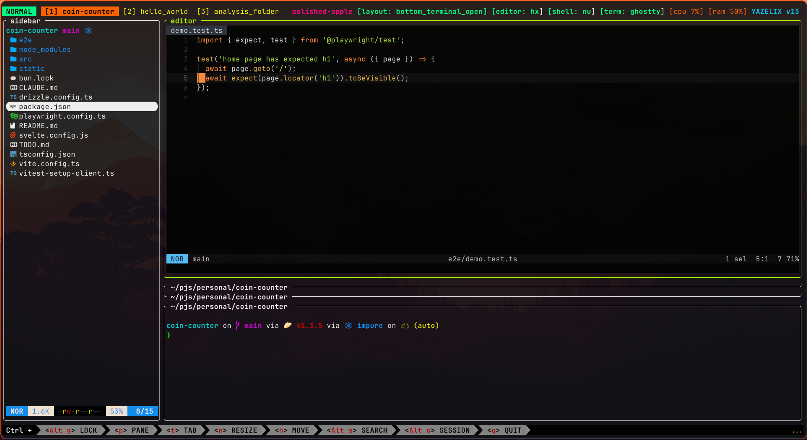

# Yazelix v14

<div align="center">
  
</div>

## Preview


The repo keeps one maintained static preview. Add richer demos only when there is a clear front-door surface that actually needs them; see [docs/preview_assets.md](docs/preview_assets.md) for the lightweight capture policy.

## Overview
Yazelix integrates [Yazi](https://github.com/sxyazi/yazi), [Zellij](https://github.com/zellij-org/zellij), and [Helix](https://helix-editor.com) (hence the name!), with first-class support for [Neovim](https://neovim.io) too.

- Yazelix now uses the managed `yazelix.toml` config surface. The legacy `yazelix.nix` config is gone, and the normal flake surface is the packaged `yazelix` runtime plus the top-level Home Manager module. Repo work now uses the flake maintainer shell defined in `maintainer_shell.nix`.

- **Use your preferred shell**: Bash, Fish, Zsh, or Nushell - Yazelix works with all of them
- Zellij orchestrates everything, with Yazi as a sidebar and your chosen editor (Helix by default)
- Toggle focus between the sidebar and editor with `Ctrl y`, and toggle the sidebar itself with `Alt y`
- Every keybinding from Zellij that conflicts with Helix is remapped [see here](#keybindings)
- When you hit Enter on a file/folder in the "sidebar":
  - **With Helix or Neovim**: Targets the managed `editor` pane through the Yazelix Zellij plugin. If that pane exists in the current tab, the file opens there. If not, Yazelix launches a new editor pane titled `editor`.
  - **With other editors**: Opens the file in a new pane with your configured editor
  - It automatically renames the Zellij tab to the file's underlying Git repo or directory name
- Features include:
  - "Reveal file in sidebar" (bind `yzx reveal` to any editor-local shortcut you prefer in Helix/Neovim, and use `Ctrl y` to jump between the editor and sidebar, see [Keybindings](#keybindings))
  - A Yazi plugin to enhance the status bar in the sidebar pane, making it uncluttered, colorful, and showing file permissions
  - A [Git plugin](https://github.com/yazi-rs/plugins/tree/main/git.yazi) showing file changes in the Yazi sidebar
  - Dynamic column updates in Yazi (parent, current, preview) via the [auto-layout plugin](https://github.com/luccahuguet/auto-layout.yazi), perfect for sidebar use
  - **Modular editor support**: Helix and Neovim have full integration features, or use any other editor via `[editor].command`
- This project includes config files for Zellij, Yazi, terminal emulators, Nushell scripts, Lua plugins, and a lot of love

## Why Yazelix
Yazelix is a reproducible terminal IDE that integrates Yazi + Zellij + Helix. It delivers a consistent, fast “superterminal” locally or over SSH with zero manual setup: smart pane/layout orchestration, sidebar reveal/open flows, a curated built-in toolset, and sane defaults. It also solves helix/zellij keybinding conflicts (no need to ever lock zellij), auto‑configures great tools like starship, zoxide, carapace (that normally require editing shell config files), and includes many tools from the Yazelix Collection, like lazygit

It already comes with cool zellij and yazi plugins, some of which I maintain myself

It has features like `reveal in Yazi` (from Helix or Neovim) and opening files from Yazi in your configured editor

Supports top terminals (Ghostty, WezTerm, Kitty, Alacritty) and popular shells (Bash, Zsh, Fish, Nushell). Easy to configure via `yazelix.toml`, with the packaged runtime providing the fixed Yazelix toolset.

Get everything running in less than 10 minutes. No extra dependencies, only Nix

Install once, get the same environment everywhere

Want the high-level product map? See [Architecture Map](./docs/architecture_map.md).

## Vision
- Using the terminal should be easy, beautiful, practical and reproducible
- Good defaults over customization. Have both when possible
- Yazelix is always on the edge of project versions
- Yazelix is always evolving, it's a living being
- What is even Yazelix?
- Yazelix lets you say `I use Yazelix btw`
- Boy, do we Nix
- Integration, integration, integration
- Made with love.

## Acknowledgments
See [Yazelix Collection](./docs/yazelix_collection.md) for a full list of all projects, tools, and plugins Yazelix integrates, including links to each project and their homepages.

<!-- BEGIN GENERATED README LATEST SERIES -->
## What's New In v14

Boundary hardening, honest update ownership, and a much cleaner runtime surface.

- Launch, runtime, and desktop startup got much harder to break on flake-installed or Home Manager-owned setups.
- Workspace truth moved deeper into the pane orchestrator with explicit sidebar identity and cleaner retargeting semantics.
- Home Manager became a cleaner first-class path with profile-owned `yzx`, `yzx home_manager prepare` to preview or archive manual-install artifacts before Home Manager takeover, and better validation around generated config surfaces.
- The packaged runtime became the honest center of the install story, with `runtime/current` and installer-owned indirection trimmed back sharply.
- `yzx update` now points at explicit owners: `yzx update upstream` for upstream/manual installs and `yzx update home_manager` for Home Manager installs.
- `yzx update` now points at explicit owners, the transitional `yzx update runtime` / `yzx update all` flow is gone again, and `yzx run` became a real argv passthrough for one-shot tools like `yzx run rg --files`.
- The current v14 line also carries forward the front-door UX expansion introduced late in v13, including the welcome style selector, the live `game_of_life` welcome mode, `yzx screen` to preview the animated welcome screen directly in the terminal, and the managed popup runner with configurable popup commands and sizing.
- Config ownership and upgrade UX became much more explicit through `user_configs/`, the separate `yazelix_packs.toml` file, the migration engine, and first-run upgrade summaries instead of ad hoc breakage.
- Workspace control also matured across the line with managed editor/sidebar routing, deterministic sidebar controls, and `yzx cwd` to retarget the current tab workspace root with editor/sidebar sync.
- A large delete-first cleanup pass trimmed broad helper surfaces and documented the trim-first path toward v15.
- v14 is the last feature release of Yazelix Classic: the broader `devenv`-era shape with `yazelix packs`, dynamic runtime management, shell and terminal breadth, and the wider `yzx` surface, including `yzx packs`. The `v14` tag stays alive for bug fixes, but the line is now feature-frozen.
- The current v15 direction is to keep the narrower core `yzx` product surface around `launch`, `env`, `update`, `desktop`, and workspace-facing commands while trimming the older Classic machinery around `yzx refresh`, much of `yzx run`, `yzx packs`, launch-profile reuse, and the broad `devenv` lifecycle.
- The broader `devenv` runtime and terminal-environment layer may continue as a separate project forked from Yazelix Classic and could be reintegrated later only with much clearer boundaries and separate codebases.
- I still strongly recommend using v14 for the time being, especially if you are a power user. It remains unusually powerful, highly customizable, alive, and worth filing issues against.

For exact v14 upgrade notes, see [CHANGELOG](./CHANGELOG.md) or run `yzx whats_new`.
For the longer project story, see [Version History](./docs/history.md).
<!-- END GENERATED README LATEST SERIES -->

## Yazelix Classic And v15

Yazelix v14 is the last feature release of **Yazelix Classic**: the broad, heavily integrated, `devenv`-based version of the project. This is the line with `yazelix packs`, `yzx packs`, dynamic runtime management, rich shell and terminal integration, Home Manager and manual install support, and the widest power-user command/config surface.

Classic is not abandoned. For now, `main` remains the v14.x / Yazelix Classic line that users should keep using. The `v14` tag stays as the immutable original v14 release, and future Classic fixes can be tagged as `v14.1`, `v14.2`, and so on when needed.

v15 work lives separately on the `v15` branch until it is ready for alpha testing. The goal is a slimmer, Rust-rewritten, more performant Yazelix that stops trying to also be a broad package-and-environment manager. That means dropping `devenv`, trimming the command and config surface, and keeping a clearer core around fast workspace entry and explicit update ownership.

On the current `v15` branch, the trimmed contract is already narrower: no `yazelix_packs.toml`, no runtime-local `devenv`, no launch-profile reuse semantics, a fixed packaged runtime toolset, built-in Ghostty on Linux and macOS, and explicit update owners through `yzx update upstream` or `yzx update home_manager`.

The important split is this: Yazelix Classic is both a terminal workspace and a runtime/package-environment manager. v15 is intended to become the narrower workspace product. The broader `devenv` runtime and terminal-environment layer may continue later as a separate project forked from Yazelix Classic, and it could be reintegrated in a future release only with clearer boundaries and separate codebases.

I still strongly recommend using v14 for the time being, especially if you are a power user. It is unusually powerful, highly customizable, and very much alive. If you find bugs in the Classic line, please open issues.

For the current trimmed branch contract, see [docs/specs/v15_trimmed_runtime_contract.md](./docs/specs/v15_trimmed_runtime_contract.md).

## Experiments

- **Nixless (System) Mode** – Experimental work lives on the `nixless-system-mode` branch and might never land in `main`.

## Compatibility
- **Platform**: Works on Linux and macOS
- **Terminal**: Ghostty is built into Yazelix on Linux and macOS. WezTerm, Kitty, and Alacritty remain supported PATH-provided alternatives; Foot remains a Linux-only PATH-provided alternative
- **Editor**: Any editor works. Helix and Neovim have first-class support (reveal in sidebar, open buffer in a running instance, managed editor-pane targeting). Configure via `[editor].command` in `yazelix.toml`
- **Shell**: Bash, Fish, Zsh, or Nushell - use whichever you prefer

## Installation

```bash
nix profile install github:luccahuguet/yazelix#yazelix
yzx launch
```

One-off use without installing also works:

```bash
nix run github:luccahuguet/yazelix#yazelix -- launch
```

Prefer declarative installs? Use the top-level Home Manager module in [home_manager/README.md](home_manager/README.md). The legacy `#install` app remains only as a compatibility/bootstrap surface.

📖 **[Complete Installation Guide →](./docs/installation.md)** - Detailed step-by-step setup instructions

## Updating

Choose one update owner for each Yazelix install. Do not mix both update paths for the same installed runtime.

- Upstream/manual installs: use `yzx update upstream`
- Home Manager installs: use `yzx update home_manager`

`yzx update upstream` prints and runs:

```bash
nix run --refresh github:luccahuguet/yazelix#install
```

`yzx update home_manager` refreshes the current flake input with:

```bash
nix flake update yazelix
```

and then prints `home-manager switch` for you to run yourself.

Updating replaces the installed runtime that future launches use. Already-open Yazelix windows keep running their current live runtime until you explicitly relaunch them or run `yzx restart`; Yazelix does not silently hot-swap live sessions in place.

### Helix Integration
Helix supports optional `yzx reveal` integration through `Alt+r`. Yazelix now reserves `Alt+r` globally: in the managed editor it forwards `Alt+r` into Helix for reveal, and outside the editor it falls back to the editor/sidebar focus flow. `Ctrl+y` and `Alt+y` remain the dedicated workspace navigation keys.

📖 **[Complete Helix Keybindings Guide →](./docs/helix_keybindings.md)** - Recommended keybindings for enhanced editing experience

### Neovim Integration
For Neovim-Yazi integration, bind `yzx reveal` to any editor-local shortcut that does not conflict with your terminal or Zellij bindings. A good default is `<M-r>`:

This assumes `yzx` is on your editor `PATH`.

```lua
-- Yazelix sidebar integration - reveal current file in Yazi sidebar
vim.keymap.set('n', '<M-r>', function()
  local buffer_path = vim.fn.expand('%:p')
  if buffer_path ~= '' then
    vim.fn.system({ 'yzx', 'reveal', buffer_path })
  end
end, { desc = 'Reveal in Yazi sidebar' })
```

📖 **[Complete Neovim Keybindings Guide →](./docs/neovim_keybindings.md)** - Setup instructions and workflow tips

## Version Check
Check installed tool versions:
```bash
nu nushell/scripts/utils/version_info.nu
```

## Editor Pane Orchestration

When opening files from Yazi, Yazelix will:
- Ask the Yazelix pane orchestrator plugin for the managed `editor` pane in the current tab.
- Reuse that pane directly when it exists, instead of scanning nearby panes or depending on stack position.
- Create a new pane titled `editor` when no managed editor pane exists yet.
- Use the same managed-pane flow for both Helix and Neovim; configure the editor via `[editor].command` in `yazelix.toml`.

## POSIX/XDG Paths

Yazelix respects XDG directories for config, data, state, and cache. See POSIX/XDG Paths for details: ./docs/posix_xdg.md

## SSH / Remote

Yazelix shines over SSH: the TUI stack (Zellij, Yazi, Helix) runs cleanly without any GUI, giving you a fully configured, consistent “superterminal” on barebones hosts (for example, an AWS EC2 instance). The Yazelix environment delivers the same tools, keybindings, and layouts you use locally, minimizing drift on ephemeral servers.

## Customization & Configuration

Yazelix uses a **layered configuration system** that safely merges your personal settings with Yazelix defaults:

- **Core settings**: Edit `~/.config/yazelix/user_configs/yazelix.toml` for shell, editor, terminal, and package preferences
- **Yazi customization**: Configure plugins, theme, and sorting in `yazelix.toml` under the `[yazi]` section (see [Yazi Configuration](./docs/yazi-configuration.md))
- **Zellij customization**: Add personal overrides in `configs/zellij/personal/` directory
- **Your configs persist** across Yazelix updates without git conflicts
- **Intelligent merging**: TOML sections merge properly, avoiding duplicate keys and conflicts

📖 **[Complete Customization Guide →](./docs/customization.md)** - Detailed instructions for customizing every tool

### Editor Configuration

📝 **[Editor Configuration Guide →](./docs/editor_configuration.md)** - Complete guide for configuring editors

**Quick setup:**
- **Default (recommended)**:
  ```toml
  [editor]
  command = ""
  ```
- **Neovim**:
  ```toml
  [editor]
  command = "nvim"
  ```
- **System Helix**:
  ```toml
  [editor]
  command = "hx"

  [helix]
  runtime_path = "/path/to/runtime"  # Only when your Helix runtime is outside normal discovery paths
  ```
- **Other editors**:
  ```toml
  [editor]
  command = "vim"
  ```

### Alternative: CLI-Only Mode
To use Yazelix tools without starting the full interface (no sidebar, no Zellij), use:
```bash
yzx env
```
This loads all tools (helix, yazi, lazygit, etc.) into your current shell, with Yazelix env vars set and clean messaging, and automatically launches the shell configured in your `yazelix.toml`. Prefer the legacy behavior? Run `yzx env --no-shell` to stay in your current shell.

If you want the Yazelix tool PATH without switching into your configured shell, use:
```bash
yzx env --no-shell
```

### Packages & Customization

**What Gets Installed:**
See the full catalog of tools and integrations in the Yazelix Collection:
[docs/yazelix_collection.md](./docs/yazelix_collection.md).
- **Essential tools**: [Yazi](https://github.com/sxyazi/yazi) (file manager), [Zellij](https://github.com/zellij-org/zellij) (terminal multiplexer), [Helix](https://helix-editor.com) (editor), shells (bash/nushell, plus your preferred shell), [fzf](https://github.com/junegunn/fzf), [zoxide](https://github.com/ajeetdsouza/zoxide), [Starship](https://starship.rs)
- **Bundled helpers**: [lazygit](https://github.com/jesseduffield/lazygit) (or `lg`), [mise](https://github.com/jdx/mise), [carapace](https://github.com/carapace-sh/carapace-bin), [macchina](https://github.com/Macchina-CLI/macchina), and the fixed helper tooling behind the trimmed v15 core
- **Optional history**: [atuin](https://github.com/atuinsh/atuin) integration is now controlled by `enable_atuin` (disabled by default).
- **Yazi preview helpers**: `p7zip`, `jq`, `poppler`, `fd`, `ripgrep` are part of the fixed runtime surface
- **Environment setup**: Proper paths, variables, and shell configurations

**Customize Your Installation:**
If you followed [step 4 in the installation guide](./docs/installation.md#step-4-configure-your-installation-optional), you already have your `~/.config/yazelix/user_configs/yazelix.toml` config file ready. You can modify it anytime and restart Yazelix to apply changes. See [yazelix_default.toml](./yazelix_default.toml) for all available options and their descriptions.

**Terminal Emulator Selection:**
- **Ghostty** (default preference): Modern, fast terminal written in Zig with great performance
- **WezTerm** (recommended fallback): Best image preview support in Yazi
- **Kitty**: Fast, feature-rich, GPU-accelerated terminal
- **Alacritty**: Fast, GPU-accelerated terminal written in Rust
- **Foot**: Wayland-native terminal (Linux-only)
- **Auto-detection**: Fallback order follows your configured terminal list
- Configure your preference in `yazelix.toml` with `terminals = ["ghostty", "wezterm", ...]` (first item is primary)
- **v15 terminal contract**: Yazelix launches host-installed terminals directly. Keep one of your configured terminals available on the host `PATH`.

[See the full Customization Guide here.](./docs/customization.md)

---

## Home Manager Integration

Yazelix includes optional Home Manager support for declarative configuration management through the top-level flake's `homeManagerModules.default` output. See [home_manager/README.md](home_manager/README.md) for setup instructions.

## Notes
- The packaged runtime respects your HOME/XDG paths directly, so managed config and generated-state paths resolve without extra flags
- Tweak configs to make them yours; this is just a starting point! 
- For extra configuration, see: [WezTerm Docs](https://wezfurlong.org/wezterm/config/files.html)
- Add more swap layouts as needed using the KDL files in `configs/zellij/layouts`
- Use `lazygit`, it's great

## When should you not use yazelix?
- If you hate having fun
- If you suffer from a severe case of nix-allergy

## Initializer Scripts
Yazelix auto-generates initialization scripts for Starship, Zoxide, Mise, and Carapace for your configured shell set during environment setup and refresh. See [docs/initializer_scripts.md](./docs/initializer_scripts.md) for details.

## yzx Command Line Interface

🔧 **Complete CLI Reference:** `yzx help` - Shell-agnostic command suite

📖 **[Complete yzx CLI Documentation →](./docs/yzx_cli.md)** - Comprehensive command reference and usage guide

**Quick Commands:**
- `yzx launch` - Launch Yazelix in new terminal (current directory by default)
- `yzx enter` - Start Yazelix in current terminal
- `yzx launch --path DIR` - Launch in specific directory
- `yzx launch --home` - Launch in home directory
- `yzx launch --terminal ghostty` - Force a particular terminal for this launch
- `yzx launch --verbose` - Print detailed launch diagnostics
- `yzx env [--no-shell]` - Load Yazelix tools without UI (`--no-shell` keeps your current shell)
- `yzx refresh [--force] [--verbose] [--very-verbose]` - Repair generated Yazi/Zellij runtime state without launching UI
- `yzx run <command> [args...]` - Run a single command inside the Yazelix environment
- `yzx update` - Show the supported update-owner paths
- `yzx update upstream` - Refresh Yazelix from the upstream installer surface
- `yzx update home_manager` - Refresh the current Home Manager flake input, then print `home-manager switch`
- `yzx config [--path]` - Show the active config or print its resolved path
- `yzx edit config` - Open the main managed Yazelix config file in your editor
- `yzx restart` - Restart Yazelix in a fresh window
- `yzx doctor [--verbose] [--fix]` - Health checks and diagnostics
- `yzx dev profile [--cold] [--clear-cache]` - Profile startup phases and write a structured report under `~/.local/share/yazelix/profiles/startup/`
- `yzx status [--versions] [--verbose]` - Show current Yazelix status, tool versions, and shell hook details

## Troubleshooting

🔍 **Quick diagnosis:** `yzx doctor` - Automated health checks and fixes

📖 **[Complete Troubleshooting Guide →](./docs/troubleshooting.md)** - Comprehensive solutions for common issues

## Editor Terminal Integration
Want to use Yazelix tools (Nushell, zoxide, starship, lazygit) inside your editor? Zed, VS Code, and Cursor all work seamlessly with `yzx env`.

**Quick Setup:**
1. Open your editor's integrated terminal
2. Run `yzx env` to load all Yazelix tools without the UI in your configured shell
3. Enjoy the full Yazelix environment in place
Need to stay in your editor's existing shell? Run `yzx env --no-shell` instead.

For more advanced integration options, see our [Zed + VS Code terminal integration guide](./docs/editor_terminal_integration.md).

## Styling and Themes
Yazelix includes transparency settings and theme configurations for a beautiful terminal experience. The terminal emulator configs include transparency settings you can comment/uncomment, and Helix comes with transparent theme options. See [docs/styling.md](./docs/styling.md) for customization details.

For Helix themes, you can use transparent themes by editing your Helix config:
```toml
# theme = "base16_transparent"
theme = "term16_dark"  # Recommended transparent theme
```

## Layouts
Yazelix includes adaptive layouts that organize your workspace. Use `three_column` for Claude Code and AI tools, and more. See [docs/layouts.md](./docs/layouts.md) for details and customization.

## Keybindings

Yazelix uses Zellij as the workspace layer, so the most important bindings are global workspace bindings rather than editor-local shortcuts. Run `yzx keys` inside Yazelix for the live summary, and see [docs/keybindings.md](./docs/keybindings.md) for the full reference.

| Keybinding | What It Does |
|------------|--------------|
| `Ctrl+y` | Toggle focus between the managed editor and Yazi sidebar |
| `Alt+y` | Open or close the sidebar |
| `Alt+r` | Smart reveal/focus key; forwards into the editor when appropriate |
| `Alt+[` / `Alt+]` | Switch between layouts |
| `Alt+m` | Open a new terminal in the current tab workspace root |
| `Alt+t` | Toggle the configured managed popup program, usually `lazygit` |
| `Alt+Shift+M` | Open the `yzx` command palette popup |
| `Alt+1..9` | Jump directly to tabs 1 through 9 |
| `Alt+w` / `Alt+q` | Move to the next or previous tab |
| `Alt+Shift+H` / `Alt+Shift+L` | Move the current tab left or right |
| `Alt+Shift+F` | Toggle pane fullscreen |

Yazi still has its own keymap too. Press `~` inside Yazi for its built-in help. The most useful Yazelix-specific sidebar flows are `Enter` to open through the managed editor integration, `Alt+z` to pick a directory with zoxide and retarget the workspace, and `Alt+p` to open the selected directory in a new pane as the current tab workspace root.

Helix and Neovim integration is intentionally small. Use `Ctrl+y` and `Alt+y` for workspace navigation, and use `Alt+r` / `yzx reveal` when you want the editor to reveal the current file in the managed Yazi sidebar. See [docs/helix_keybindings.md](./docs/helix_keybindings.md) and [docs/neovim_keybindings.md](./docs/neovim_keybindings.md) for editor-local setup details.

## I'm Lost! Too Much Information
Start by learning Zellij on its own, then optionally Yazi, and re-read this README afterwards

## Contributing to Yazelix
See [contributing](./docs/contributing.md)
