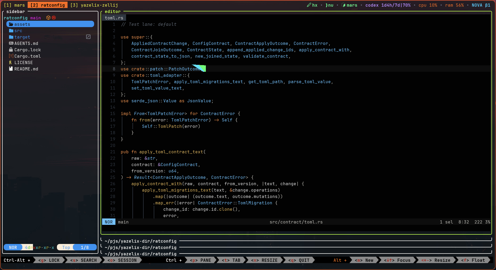

# Yazelix Nova Beta

<div align="center">
  
</div>

**What is the best possible terminal experience?**

Yazelix tries to answer that question by bringing the terminal, multiplexer,
file manager, editor, shell, Git tools, configuration, and an optional AI agent
together as one coherent workspace

Yazelix ships as a Nix flake with an optional Home Manager module

`yzx launch` opens Mars, while `yzx enter` starts Yazelix in the
current terminal. Both provide the same Yazi-first workspace and compact top
bar. The repo keeps one launcher, one config root, one packaged layout, and
focused checks for its contracts

## Preview



## Install and launch

Yazelix requires Nix with flakes enabled. `launch` opens the packaged Mars window
in a graphical session, while `enter` starts the same workspace in the current
terminal or over SSH

Yazelix uses packaged defaults, so no configuration is required before the
first launch

### Try without installing

```sh
nix run github:luccahuguet/yazelix -- launch
nix run github:luccahuguet/yazelix#runtime -- enter
```

If the one-off launch fails, inspect the owned runtime setup with:

```sh
nix run github:luccahuguet/yazelix -- doctor
```

### Install in a Nix profile

```sh
nix profile add --refresh github:luccahuguet/yazelix
yzx launch
```

### Install with Home Manager

Use the [Home Manager module](docs/installation.md#home-manager) for a declarative install

From a local checkout, use:

```sh
nix run .#yazelix -- launch
nix run .#runtime -- enter
```

### Moving from Yazelix Classic

Use Classic v17.12 once to prepare its config for the Nova generation, then
install Yazelix from the canonical repository

```sh
nix run github:luccahuguet/yazelix/v17.12#yazelix -- launch
```

The Nova cutover intentionally replaces the old `main` history. Existing Git
clones should be replaced with a fresh clone rather than updated with an
ordinary pull. Classic remains available at the frozen `classic` branch, while
the immutable `v17.12` tag remains the migration and rollback bridge

## Learn, help, and recover

Start the guided tour after launching Yazelix:

```sh
yzx tutor begin
```

`yzx help` lists every command. `yzx doctor` checks the owned runtime setup
without opening Mars or Zellij. Inside Yazelix, press `Alt Shift M` to open the
command palette, which includes both help and tutor entries

Press `Alt Shift K` to open Ratconfig. Press `8` for native Yazi settings and
flavors, or `9` for the read-only packaged key reference. Use `1`-`9` to jump
directly to a tab, `Tab`/`Shift-Tab` or `h`/`l` to change tabs, `j`/`k` to move,
and `/` to search. Use `e`, `Enter`, or `Space` for the selected row's
contextual action, such as editing or opening it. Press `u` to reset a setting
and `q` to quit. When a writable structured row has one owning file action, `e`
opens that exact config file. The footer lists the selected row's controls

Yazelix carries Helix/Vim's `h/j/k/l` motion model through the workspace:

| Layer | `h` | `j` | `k` | `l` |
| --- | --- | --- | --- | --- |
| Helix normal mode | Move cursor left | Move cursor down | Move cursor up | Move cursor right |
| `Alt` | Focus left or previous tab | Focus down | Focus up | Focus right or next tab |
| `Ctrl Alt` | Move tab left | Move pane down | Move pane up | Move tab right |

The default `Alt Shift` layer keeps the sidebar and four popups in the same
keyboard neighborhood:

```text
H             J          K          L
sidebar       Git        Ratconfig  agent
                    M
                    menu
```

`Alt Shift H` toggles the sidebar. Press a popup's own key again to close Git,
Ratconfig, or the menu. Git and the agent use the tab's canonical workspace
root even when the focused pane has navigated elsewhere. The agent popup hides
instead of closing, so its process remains available until the workspace root
really changes. While the managed agent exposes a spinner title, its tab gains
a compact busy marker without changing the tab's native name

## Keybindings

Ratconfig's Keys tab is the complete packaged reference, and
`defaults/zellij/config.kdl` remains the runtime source

### Zellij workspace

| Key | Action |
| --- | --- |
| `Ctrl Alt g` | Toggle locked mode |
| `Ctrl Alt o` | Open session mode |
| `Ctrl q` | Quit Yazelix session |
| `Ctrl p` | Toggle pane mode |
| `Ctrl t` | Toggle tab mode |
| `Ctrl n` | Toggle resize mode |
| `Alt m` | Open a new pane |
| `Alt Shift F` | Toggle the focused pane fullscreen |
| `Ctrl y` | Toggle focus between the editor and Yazi sidebar |
| `Alt 1-9` | Go directly to tab 1-9 |

Move mode is unbound. Managed popup triggers can be remapped through
`keybindings.config`, `keybindings.agent`, `keybindings.git`, and
`keybindings.menu`. Raw Zellij keymaps stay outside the managed sidecar

### Helix

| Key | Action |
| --- | --- |
| `Alt r` | Reveal the current editor file in Yazi |

### Yazi

| Key | Action |
| --- | --- |
| `Alt z` | Retarget the tab workspace with zoxide |

## Commands

| Command | Purpose |
| --- | --- |
| `yzx`, `yzx help` | Print command help |
| `yzx --version` | Print the exact package-owned Yazelix version |
| `yzx launch [zellij-args...]` | Open Mars first, then start managed Zellij |
| `yzx enter [zellij-args...]` | Start managed Zellij in the current terminal |
| `yzx run <program> [args...]` | Run exact argv inside the prepared Yazelix environment |
| `yzx config` | Open the Ratconfig-backed config UI |
| `yzx menu` | Open the command palette |
| `yzx doctor` | Check owned runtime setup without launching Mars or Zellij |
| `yzx status` | Print config/runtime paths and selected settings |
| `yzx status --json` | Print the versioned machine-readable status record |
| `yzx env` | Open the managed shell without launching the UI |
| `yzx tutor [lesson]` | Print guided Yazelix lessons |
| `yzx screen [style]` | Show a terminal welcome screen |
| `yzx reveal <target>` | Reveal a file or directory in the managed Yazi sidebar |

Status JSON contains numeric `schema_version = 1`, plus `name`, `version`,
`package`, `config_home`, `state_dir`, `shell`, `editor_command`, `editor`,
`agent_command`, and `inside_zellij`. The sponsor URL remains in `yzx help`
without a public `sponsor` command

The top-right Zellij corner shows the compact release line derived from the
same version: `NOVA DEV` in development, `NOVA βN` during the v1 beta line,
and `NOVA 1.0` for the stable release

Screen styles are `static`, `logo`, `boids`, `boids_predator`,
`boids_schools`, `mandelbrot`, `game_of_life_gliders`,
`game_of_life_oscillators`, `game_of_life_bloom`, and `random`

Tutor lessons are `workspace`, `discovery`, `troubleshooting`, and
`tool_tutors`. `yzx tutor hx` and `yzx tutor nu` print the native tool tutor
commands


## Packages and platforms

The default package includes Mars and opens the full graphical workspace with
`yzx launch`. The fixed `runtime` package keeps the same `yzx` command,
managed tools, and configuration without Mars or desktop assets

See [Installation and packages](docs/installation.md) for package variants,
platform support, SSH use, measured sizes, Home Manager, and updates

## Configuration

`yzx config` opens Ratconfig over the managed tree at
`~/.config/yazelix/`. Yazelix inherits packaged defaults and persists only
explicit overrides

See [Configuration](docs/configuration.md) for settings, popups, native files,
Yazi plugins, cursor ownership, and editor behavior

## Development

See [Development](docs/development.md) for CI, local checks, runtime input
overrides, and the LOC scorecard. Lower-level launch, config, editor, shell, and
popup contracts live in [Runtime Notes](docs/runtime-notes.md)

## LOC Scorecard

Yazelix owns **18,217 lines** of tracked text project files. The
[reproducible scorecard](docs/development.md#loc-scorecard) excludes Beads,
lockfiles, and binary assets
