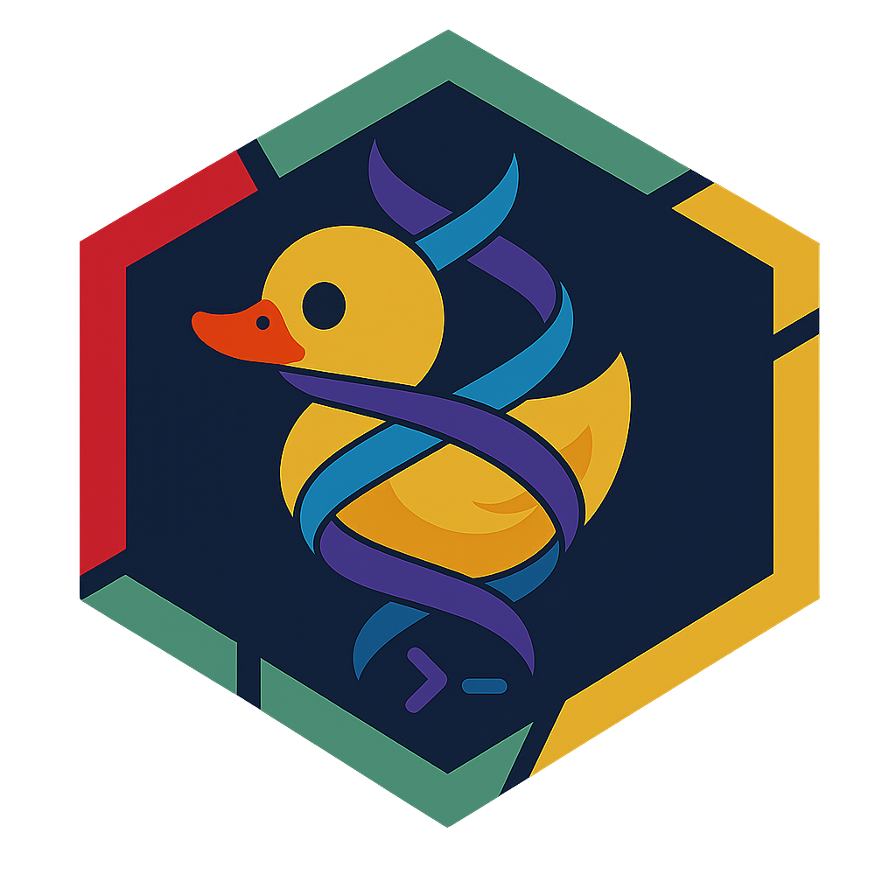
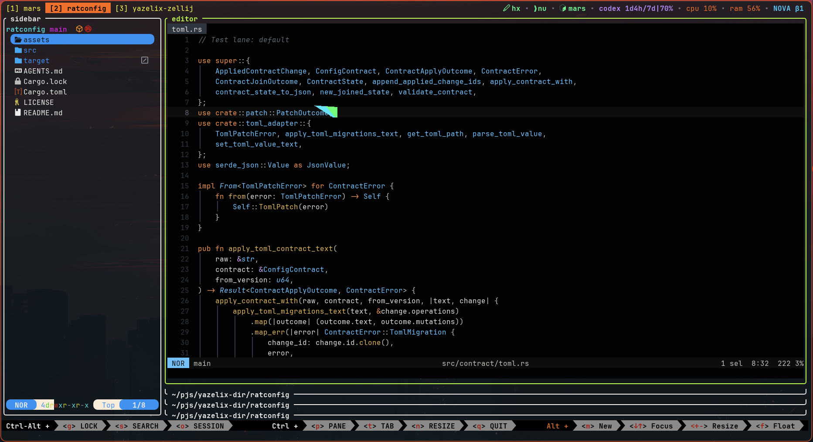

# Yazelix Nova

<div align="center">
  
  <p><strong>Delight is the only option.</strong></p>
</div>

Yazelix Nova is a Nix-packaged terminal workspace built around
[Nova Rio](https://github.com/Yazelix/nova-rio), a minimal
[Nova Zellij fork](https://github.com/Yazelix/nova-zellij),
Yazi, Nushell, Bash, Zsh, and Fish with Atuin history, a lazygit popup (but you can configure other git clients!), and
an optional coding agent popup. Yazelix Forest provides the default managed
Helix file tree, and the narrow Yazelix zj-radar fork provides the collapsible
Zellij rail. Nova uses the
[Nova Helix fork](https://github.com/Yazelix/nova-helix) by default
(but `editor.command` can select your preferred terminal editor). `yzx launch`
opens the desktop workspace through Rio, while `yzx enter` opens Yazelix in any
capable terminal emulator or over SSH. Great defaults out of the box!

If Yazelix is useful to you, [support its development on GitHub
Sponsors](https://github.com/sponsors/luccahuguet).

## Preview



## Nova vs Classic

*TLDR: Nova v1.0.0 gives each component one job and delivers the full workspace
in one quarter of Classic's code. This comparison stays fixed to that release.*

Classic was bloated and built on the wrong ownership model. Its main repository
acted as the product runtime, component control plane, configuration repair
system, compatibility layer, and maintainer toolbox.

Classic's child repositories did not create firm boundaries. The main repo
still carried their maintenance machinery and overlapping runtime logic. Nova
gives [component dependencies](#components) firm package
boundaries. Each component owns its implementation and contract. Nova pins and
composes their package outputs.

| Measure | Nova v1.0.0 | Classic |
| --- | --- | --- |
| Code and configuration (Rust, Nix, shell, TOML, etc.) | **23,272 LOC** | **91,545 LOC** |
| Rust | **19,872 LOC** | **80,957 LOC** |
| Ownership model | One owner per concern | Overlapping responsibilities across layers |
| Yazelix component boundaries | Independent, versioned packages | Child repos mixed with main-repo ownership |
| Product experience | More features, stronger defaults, tighter integration, and polished UX | Fewer features and a less cohesive workspace |
| Status | Recommended | Frozen migration and rollback path |

Nova v1.0.0 owns **68,273 fewer lines**, a **75% reduction**. Classic's Rust code
alone is 3.5 times larger than Nova's entire code and configuration surface.

Nova v1.0.0 delivers more features in 25% of the code. It has a clearer
configuration model, tighter editor and Yazi integration, stronger
diagnostics, and a coherent popup-oriented interface. The smaller architecture
makes Yazelix easier to improve and better to use.

Classic proved the idea. Nova is the better product and the architecture
Yazelix should have had from the start.

## Install and launch

*TLDR: Install Stable for the dogfooded release, Main for frequent updates, or
Edge for experimental changes.*

Yazelix requires Nix with flakes enabled. `launch` opens the packaged Rio window
in a graphical session, while `enter` starts the same workspace in the current
terminal or over SSH.

The `stable` branch advances from a verified and dogfooded `main` revision,
normally at least seven days apart. Urgent fixes may arrive sooner with the same
verification. Channels share one linear history: `stable ⊆ main ⊆ edge`;
promotions include every intervening commit. Use `main` for frequent updates or
an immutable `nova-v*` tag for an exact release. `edge` is the opt-in experimental
dogfood channel. See the [promotion policy](docs/development.md#edge-main-and-stable).

Linux launchers show their selected channel as `Yazelix Nova (Stable)`,
`Yazelix Nova (Main)`, or `Yazelix Nova (Edge)`. Stable uses the default
`yazelix` package; Main and Edge use the explicit `yazelix-main` and
`yazelix-edge` outputs so the immutable package owns its launcher label. The
same package identity remains visible inside sessions as `NOVA 1.2 STABLE`,
`NOVA 1.2 MAIN`, or `NOVA 1.2 EDGE`, depending on the version and channel installed.

Linux is the dogfooded platform. CI builds all packages and a Home Manager
activation on `aarch64-darwin`. Sustained interactive macOS beta use has found
no known regression; the earlier per-command checklist and Rio GUI remain
unverified.

### Try without installing

```sh
nix run github:Yazelix/nova/stable -- launch
nix run github:Yazelix/nova/stable -- enter
```

If the one-off launch fails, inspect the owned runtime setup with:

```sh
nix run github:Yazelix/nova/stable -- doctor
```

### Install in a Nix profile

```sh
nix profile add --refresh github:Yazelix/nova/stable
yzx launch
```

### Install with Home Manager

Use the [Home Manager module](docs/installation.md#home-manager) for a
declarative install. The default example preserves Nova's locked dependencies;
configure the [binary cache](docs/installation.md#binary-cache) to reuse
published builds. Dependency overrides may require source builds.

### Moving from Yazelix Classic

Classic v17.12 translates mutable Classic `settings.jsonc` or `config.toml`
files into Nova configuration. It does not rewrite Home Manager declarations
or Home Manager-owned files. Run the bridge once when you need to preserve
mutable Classic settings:

```sh
nix run github:Yazelix/nova/v17.12#yazelix -- launch
```

If your Classic settings match packaged defaults, start with Nova's packaged
defaults and move straight to `stable`. Home Manager users must replace
Classic-only options with Nova's narrow module surface before switching.

After switching, `yzx doctor` reports recognized Classic `configs/` and
`sessions/` state, generated Nushell extern artifacts, and migration backups in
the active Yazelix roots. These are read-only warnings: `nova=unused` means Nova
did not load the path, while `ownership=ambiguous` means its contents or owner
cannot be proven from the pathname alone. Nova does not archive or remove the
reported paths, and external scripts may still reference them.

The Nova cutover intentionally replaces the old `main` history. Existing Git
clones should be replaced with a fresh clone rather than updated with an
ordinary pull. Classic remains available at the frozen `classic` branch, while
the immutable `v17.12` tag remains the migration and rollback bridge.

## First five minutes

*TLDR: Start with `yzx tutor begin`, then use the Alt-based `h/j/k/l` grid to
move around the workspace.*

Start the guided tour after launching Yazelix:

```sh
yzx tutor begin
```

`yzx help` lists every command. `yzx doctor` gives a compact, colored health
summary without opening Rio or Zellij; `yzx doctor --verbose` expands diagnostic
evidence, while `yzx status` owns paths and settings. Inside Yazelix, press
`Alt Shift M` to open the command palette, including help, tutor and Radar
agent-activity setup.

Doctor and status inspect without creating or repairing configuration, runtime
files or plugin permissions. Missing runtime files are initialized by the
existing launch/run commands; diagnostics report them without preparing a session.

Hold `Ctrl` to underline links and Ctrl-click to open them in Rio on Linux;
use `Cmd` on macOS. This works inside Zellij as well as in a plain terminal.

### Ratconfig

Press `Alt Shift K` to open Ratconfig:

| Key | Action |
| --- | --- |
| `1`-`9` | Jump to a tab |
| `Tab` / `Shift-Tab`, `h` / `l` | Change tabs |
| `j` / `k`, `/` | Move through rows or search All settings |
| `a` | Switch between Overview and All when the tab has a meaningful reduced view |
| `e`, `Enter`, `Space` | Run the selected row's contextual action |
| `u`, `q` | Remove the selected explicit override or quit |

The footer lists the selected row's controls.

### Workspace keys

Yazelix extends Helix/Vim's `h/j/k/l` motion model into a workspace key grid.
The `Alt` and `Ctrl Alt` layers move focus, tabs, or panes, while `Alt Shift`
groups four workspace surfaces:

| Layer | `h` | `j` | `k` | `l` |
| --- | --- | --- | --- | --- |
| `Alt` | Focus left or previous tab | Focus down | Focus up | Focus right or next tab |
| `Ctrl Alt` | Move tab left | Move pane down | Move pane up | Move tab right |
| `Alt Shift` | Sidebar | Git | Ratconfig | Agent |

Yazi, the menu, and Anima use their initials:

- `Alt Shift Y` toggles the full Yazi popup.
- `Alt Shift M` toggles the command menu.
- `Alt Shift A` opens a transient random visual popup named `anima`.
  In animations, including Aquarium, `Left`/`h`/`p` selects previous and
  `Right`/`l`/`n` selects next; any other key exits. Static and logo exit on any
  key. Switching preserves the original welcome timer. This is not a session
  lock. Set `keybindings.screen` to remap or unmap it for newly launched sessions.

Run `yzx anima aquarium` for Anima's original pixel-art reef, with schooling fish,
kelp, coral, bubbles, a ray, and a sand crab. Whale and shark visitors take turns
crossing larger tanks during longer playback. Set `welcome.style = "aquarium"`
to select it at startup. `asciiquarium` remains a compatibility alias in commands
and welcome configs; it displays the native scene, not classic ASCII artwork.

Run `yzx anima plasma` for flowing color fields, `yzx anima chladni` for geometric
nodal patterns, or `yzx anima physarum` for trail networks. All three work as
`welcome.style` choices and through native previous/next browsing. Random selection
includes all current native animations, including Aquarium; static and logo remain
explicit-only choices. Native animations display fading name, credit, and navigation
cards, with black backing confined inside the rounded border. Outside Nova,
the standalone command is `anima`.

Press a popup's key again to close or hide it and return to the tiled workspace.
Managed popups leave an open sidebar rail visible, resize in place when the
sidebar toggles without restarting, and return to equal configured side margins
when the sidebar is collapsed.
Other floating panes keep running until explicitly shown again. Other useful
bindings are:

| Scope | Key | Action |
| --- | --- | --- |
| Workspace | `Ctrl q` | Quit the Yazelix session |
| Workspace | `Ctrl Alt t` | Toggle tab mode; `Ctrl t` reaches the focused application |
| Workspace | `Alt Shift T` | Open a new workspace tab |
| Workspace | `Alt Shift W` | Close the active workspace tab |
| Workspace | `Alt m` | Open a new pane |
| Workspace | `Alt Shift F` | Toggle the focused pane fullscreen |
| Workspace | `Alt Shift A` | Show a random visual popup |
| Editor | `Ctrl y` | Toggle focus between Forest and the editor |
| Radar provider | `Ctrl Alt n` / `Ctrl Alt p` | Cycle attention tabs forward / backward |
| Radar provider | `Ctrl Tab` / `Ctrl Shift Tab` | Cycle sessions forward / backward |
| Workspace | `Alt 1-9` | Go directly to tab 1-9 |
| Editor / Yazi | `Alt r` | Reveal in Yazi or return unchanged |
| Yazi | `Alt z` | Retarget the tab workspace with zoxide |

Every new tab starts with the configured sidebar and a focused, one-use tiled
Yazi picker. `Alt Shift T` and `Ctrl Alt t`, then `n`, create tabs at your home
directory; `x` in tab mode also closes a tab. The direct shortcuts pass through in locked mode.
A successful choice retargets the tab, creates the managed editor,
then removes that exact picker. Choosing a folder leaves Forest visible while
focusing the native Helix picker. `Alt Shift Y` opens the separate persistent
Yazi popup later.

The sidebar starts at 32 columns in the Zellij pane named `sidebar`, following
the configured pane-frame and rounded-corner appearance. Radar is the default.
Set `sidebar.command` and optional `sidebar.args` to run one terminal command in
the same slot on the next session. Nova passes arguments without a shell and
keeps the same placement, focus, popup-margin, and `Alt Shift H` toggle behavior.
Use `sidebar.command = "yzx-yazi"` for Nova's managed Yazi; the installed
command needs neither a separate Yazi installation nor a Nix store path.
A custom command disables Radar's key routes, permission grant, Codex setup
prompt, and doctor diagnosis. See [Configuration](docs/configuration.md#sidebar).

Radar owns activity presentation through one background controller per session.
The sidebar pane in each tab only displays its controller's frame and forwards
mouse input, avoiding a full Radar event loop and session model for every tab.
Top-bar tabs retain native names, bells, and layout indicators, with no
execution markers or fallback when Radar is hidden.
One background bar controller owns Zellij state, rendering, and command refreshes
for the session. Per-tab bars request their width, display the matching frame,
and forward mouse input without rebuilding the widget tray. They render from the
first ordered state snapshot in a new tab. Command-backed status widgets show
compact loading placeholders immediately, then replace each placeholder as its
result arrives.
Codex activity reporting requires enabled, trusted Radar hooks. These hooks send
activity events to Radar. Without them, Radar still shows ordinary pane and
command information, but receives no Codex activity status or prompt labels.
There is no equivalent hookless fallback in Nova.

With Radar selected, `Alt Shift H` selects the exact named tiled layout
underneath any visible popup, collapsing the rail to a framed divider or
restoring the same live plugin without hiding or refocusing the popup. Its
ten-frame working spinner refreshes every 200 ms and completes a two-second
cycle for the first 30 minutes of each continuous run. Longer-running jobs and
agents show a static yellow `⠿` in pane rows and the tab's selected status;
services keep `▸`. Status changes and lifecycle timers retain their behavior.
Nova Zellij grants the exact
bundled Radar artifact its five required permissions in Nova's isolated cache,
so the unfocused startup sidebar cannot trap a consent prompt. On the first
interactive Codex launch through Nova's agent popup, Nova checks the existing
Radar hooks. If they are missing, it asks once whether to install them. Enter or
`y` runs the marker-owned Radar setup before Codex starts; `n` is remembered and
starts Codex without enabling activity reporting.
Non-interactive launches do not prompt, and Nova does not repair hooks that a
user disables or removes later. Run `yzx doctor` to see the current hook state.
To set up activity reporting, including after declining, run:

```sh
yzx radar-setup
```

The same action appears in `Alt Shift M` as **Set up agent activity in Radar**.
Radar checks Codex, Claude Code and OpenCode in order, skips absent agents,
reports existing integrations and asks before changes (`y` accepts; Enter
declines). You can enable one agent and decline another. Redirected input skips
changes. Start a fresh agent session after setup; follow its restart and trust
guidance. Claude Code uses its native plugin marketplace; OpenCode uses Radar's
bridge plugin. The automatic first-launch offer remains Codex-only.

Codex setup installs and enables only Radar-owned hooks without changing trust
hashes. Run `/hooks` in Codex, review the hooks awaiting approval, then press `t`
on the Events page to trust that reviewed set together. The generated hook
quietly does nothing when `zj-radar` is unavailable, so the global Codex config
does not produce failures in Eon or another non-Nova environment. OpenCode
setup installs Radar's bridge plugin; Grok and Pi remain unchanged because
Radar does not provide adapters for them.

If popup or `Alt h` / `Alt l` shortcuts briefly stop responding immediately
after switching sessions, use `Alt 1-9` to select a tab, then retry. Native tab
selection recovers the observed intermittent state without restarting Yazelix.

Every managed `keybindings.*` setting accepts either a key chord or `false`.
Setting one to `false` removes only that shortcut on the next launch; commands,
menu entries, and popup behavior remain available through their other existing
entry points. Resetting the field in Ratconfig restores its packaged default.

Managed Helix supplies the editor binding. Terminal editors can bind the same
`yzx reveal` command; see [Configuration](docs/configuration.md#editor-and-file-opens)
for Neovim and terminal Emacs examples.

Ratconfig's Keys tab is the complete packaged reference, and
`defaults/zellij/config.kdl` remains the runtime source.

## Commands

| Command | Purpose |
| --- | --- |
| `yzx`, `yzx help` | Print command help |
| `yzx --version` | Print the exact package-owned Yazelix version |
| `yzx launch [zellij-args...]` | Open Rio first, then start managed Zellij |
| `yzx enter [zellij-args...]` | Start managed Zellij in the current terminal |
| `yzx-zellij [args...]` | Invoke Nova's exact packaged Zellij CLI |
| `yzx run <program> [args...]` | Run exact argv inside the prepared Yazelix environment |
| `yzx config` | Open the Ratconfig-backed config UI |
| `yzx yazi-config materialize --user-config-dir <path> --state-dir <path>` | Materialize and print the effective Yazi config directory for automation |
| `yzx menu` | Open the command palette |
| `yzx doctor [--verbose]` | Check runtime health; expand diagnostic evidence with `--verbose` |
| `yzx radar-setup` | Set up Radar activity reporting for Codex, Claude Code and OpenCode |
| `yzx status` | Print config/runtime paths and selected settings |
| `yzx status --json` | Print the versioned machine-readable status record |
| `yzx env` | Open the managed shell without launching the UI |
| `yzx tutor [lesson]` | Print guided Yazelix lessons |
| `yzx anima [style]` | Show a terminal animation with Anima |
| `yzx reveal <target>` | Start the persistent Yazi popup at an absolute, cwd-relative, or `~/` file or directory |

`yzx-zellij` is available inside and outside Nova sessions. It invokes the
packaged Zellij directly with native arguments and behavior; the host's `zellij`
command stays separate. Use `yzx enter` or `yzx launch` to prepare and start a
managed Nova workspace.
Nova's managed PATH includes `yzx-zellij` even when the launcher is invoked by
absolute path or through `nix run`, without the installed profile on PATH.

```sh
yzx-zellij --version
yzx-zellij --help
```

The Yazi materializer uses the selected Yazelix package's config and does not start
Yazi or prepare the interactive runtime. See [Runtime Notes](docs/runtime-notes.md#yazi)
for its output, validation, and exit-status contract.

### Sessions

*TLDR: Create a named session when you want a workspace you can return to;
attach when it is already running.*

Yazelix delegates session lifecycle to packaged Zellij. Plain `yzx enter` and
`yzx launch` create independent sessions. Add `--session NAME` to create a
fresh named session:

```sh
yzx enter --session project
yzx launch --session project
```

Use `attach NAME` with the full name of a live session. Attach preserves its
tabs, panes, processes, working directories, and Yazi-to-Helix routes without
reapplying the managed layout:

```sh
yzx enter attach project
yzx launch attach project
```

A live-name collision during named creation fails instead of attaching. A
missing attach target fails instead of creating a session.

Inside Yazelix, press `Ctrl Alt o`, then `w` to open Zellij's session manager.
Selecting a live session switches in place. Typing a missing name opens layout
selection with the Yazelix layout selected; press `Enter` to create it. Yazelix
supports immutable session names. Native rename and structural restore remain
outside the Nova v1 continuity contract.

## Packages and platforms

Package names follow `yazelix[-no-rio][-no-helix][-no-yazi]`. Each suffix
removes that managed package while retaining the integration around it.
`no-rio` is terminal-free: `yzx enter` uses the current terminal, while
`yzx launch` explains that Rio is unavailable. It installs no Rio config,
icon, or desktop entry.
`no-helix` uses the configured host editor; `no-yazi` requires matching host
`yazi` and `ya` commands.

`yazelix-main` and `yazelix-edge` are full-package channel outputs with distinct
Linux launcher and in-session identities. They reuse the same dependency graph
as `yazelix` and do not multiply the capability-variant matrix.

| Package | Rio | Managed Helix | Managed Yazi |
| --- | --- | --- | --- |
| `yazelix` | Yes | Yes | Yes |
| `yazelix-no-helix` | Yes | No | Yes |
| `yazelix-no-yazi` | Yes | Yes | No |
| `yazelix-no-helix-no-yazi` | Yes | No | No |
| `yazelix-no-rio` | No | Yes | Yes |
| `yazelix-no-rio-no-helix` | No | No | Yes |
| `yazelix-no-rio-no-yazi` | No | Yes | No |
| `yazelix-no-rio-no-helix-no-yazi` | No | No | No |

See [Installation and packages](docs/installation.md) for package variants,
platform support, SSH use, Home Manager, and updates.

## Components

Yazelix assembles focused forks, plugins, libraries, and commands:

| Component | Yazelix role |
| --- | --- |
| [Nova Rio](https://github.com/Yazelix/nova-rio) | GUI terminal used by `yzx launch`; its isolated delta adds only the Rio fixes and launch-time theme override Nova still needs |
| [Nova Zellij](https://github.com/Yazelix/nova-zellij) | Multiplexer fork based on upstream native Kitty graphics with managed appearance, three-island status hints, exact tiled-layout selection for plugins, and bounded Unix session probes |
| [Nova Helix](https://github.com/Yazelix/nova-helix) | Steel-enabled editor fork with isolated configuration and explicit workspace bridge hooks |
| [Yazelix Forest](https://github.com/luccahuguet/yazelix-forest) | Hardened Helix file tree, packaged with the Snacks renderer open by default |
| [Yazelix zj-radar](https://github.com/Yazelix/zj-radar) | Narrow fork of upstream 0.6.0 for the collapsible session and attention rail; Nova adds explicit, cross-environment-safe Codex hook setup and a smooth working animation |
| [Zellij Pane Orchestrator](https://github.com/Yazelix/zellij-pane-orchestrator) | Zellij plugin that owns tab-local workspace roots and coordinates panes, focus, popups, and the editor |
| [Zellij Popup](https://github.com/Yazelix/zellij-popup) | Zellij plugin that opens, focuses, hides, and closes configured floating TUI panes |
| [Nova Bar](https://github.com/Yazelix/nova-bar) | Compact Nova top bar with native tabs, modes, session details, and status widgets, built on the theme-aware Yazelix `zjstatus` fork |
| [Ratconfig](https://github.com/Yazelix/ratconfig) | Reusable Ratatui configuration editor and TOML patching and migration library |
| [Anima](https://github.com/Yazelix/anima) | Browsable terminal animations including the native Aquarium, Plasma fields, Chladni patterns, Physarum networks, Matrix rain, particles, and Life tumblers, exposed through `yzx anima` |
| [Yazi Bistro](https://github.com/Yazelix/yazi-bistro) | Curated complete Yazi flavors with pinned provenance, licenses, and explicit dark/light classification |
| [auto-layout.yazi](https://github.com/Yazelix/auto-layout.yazi) | Yazi plugin that changes the column layout to match the available pane width |

## Configuration

*TLDR: Use `yzx config` for common settings; open a component's native file
when Ratconfig marks a value read-only.*

`yzx config` opens Ratconfig over the managed tree at
`~/.config/yazelix/`. Yazelix inherits packaged defaults and persists only
explicit overrides. Overview combines recommended settings with every explicit,
invalid, externally managed, or diagnosed field. All includes complete owner
inventories where the owner publishes one, and the strongest honest curated or
observed inventory otherwise. Tabs whose Overview would hide fewer than three
fields or less than one quarter of their inventory simply show All.

Forest renders on the right by default so it occupies the edge opposite Radar.
Set `forest.side` to `left` or `right`; the choice applies to newly launched
managed Helix editors.

Rio owns its complete native configuration at
`~/.config/yazelix/rio/config.toml`. Yazelix seeds that file once. Ratconfig
offers blur, opacity, font family and size, line height, cursor trail, audio bell,
and quit confirmation alongside an action to open the complete file. The pinned
Rio executable supplies the field inventory, native defaults, and TOML validation;
Nova maintains no duplicate schema. Edits preserve comments and unrelated values.
Reset removes the selected override and restores Rio's native default. Controls
respect read-only and Home Manager ownership and apply on the next Rio launch;
some values also reload live. Rio-free packages contain no Rio controls or dependency.
The one reserved field is top-level `force-theme`, which Nova projects from
root `appearance.mode` when the file is writable. Every other Rio setting stays
native and user-owned.
The packaged starting point enables native background blur with 0.88 opacity,
where supported by the compositor, and uses a cyan cursor, Rio's native cursor trail, and
native `nova-dark`/`nova-light` adaptive themes. Trails follow cursor visibility;
hidden cursor moves never become trail origins, and visible animations settle
without waiting for more terminal output. Files created by that seed
become user-owned apart from `force-theme`; existing theme files remain
untouched.
Legacy `mars/config.toml` and `cursors.toml` files are preserved but ignored.

The Yazi tab consumes the native presets and official schemas paired with the
packaged Yazi version. Overview recommends ten common manager, preview, and
flavor controls. All exposes 205 base settings plus the five exact native-file
actions; search includes schema settings absent from both packaged and user
TOML. Owner-validated booleans, choices, and unconstrained strings are editable.
Numeric, structured, dynamic, and otherwise incompletely validated values open
their native file instead.

Helix does not publish a machine-readable configuration catalog. Its tab
therefore exposes every packaged Nova Helix default and every value observed
in the sparse user `config.toml` or dynamic `languages.toml`, without claiming
that those rows are the complete Helix schema. Overview recommends eight common
or integration-owned values; All and search cover the remaining packaged or
explicit rows. Rows stay read-only with their exact native-file action because
TOML shape alone does not establish Helix validation or safe edit semantics. The
effective `keys.normal.A-r` row explains Yazelix's reserved reveal binding,
while the two Steel files remain native actions.

`appearance.mode` selects `dark` or `light` for managed Yazelix components and
also controls Ratconfig's palette. With a writable Rio config, Nova projects
the mode to `force-theme` and launches Rio without a theme override. Saving the
field from Ratconfig inside that managed session updates Rio through its native
config watcher while Ratconfig, Zellij, the bar, and new Yazi opens switch to
the same side. A custom complete Rio config must provide its own adaptive theme
pair to participate.

When the Rio config is read-only, including a store-backed Home Manager file,
Nova passes the mode to Rio at launch and captures it for the session. Saving a
different root mode does not switch any managed component in that session; the
next session applies the saved mode everywhere together.

Zellij stores one dark theme and one light theme over its pinned packaged
inventory. Ratconfig inherits `ansi` and `gruvbox-light`, lets either field
retain a custom native name, and saves only explicit overrides. Legacy static
`theme` assignments remain in the user sidecar for recovery but are ignored by
the managed runtime. Yazelix passes root appearance at launch and Zellij
resolves the matching pair member. In a live-capable managed session, saving
root appearance calls Zellij's native action for that session. Zellij sends the
same mode to the top bar, which switches between its internal dark and light
palettes. Bars loaded by new tabs immediately inherit the session's current
mode, including after a live switch.

Each new managed Yazi reads the active session mode. Ratconfig offers separate
packaged dark and light flavor pools from Yazi Bistro; user-installed
unclassified flavors appear in both. `default` is the first dark choice and
uses Yazi's native preset by leaving `flavor.dark` unset. Light mode inherits
Bluloco Light. Explicit native `flavor.dark` and `flavor.light` selections
win. Yazelix projects the selected side into generated runtime config without
modifying the user or Home Manager `theme.toml`; already-running Yazi processes
stay as they are.

Set `shell.program` in Ratconfig or `config.toml` to choose packaged Nushell
(default), Bash, Zsh, or Fish for new panes and sessions.
Yazelix initializes Atuin local history and contextual `Ctrl+r` search for every
packaged shell while leaving Up-arrow with native history. Managed Nushell also
initializes Starship, Carapace completions, and zoxide. Set
`shell.atuin = false` to disable Nova's managed Atuin integration without
deleting either history store.

See [Configuration](docs/configuration.md) for settings, popups, native files,
Yazi plugins, Rio ownership, and editor behavior.

## Development

From a local checkout, use:

```sh
nix run .#yazelix -- launch
nix run .#yazelix -- enter
```

See [Development](docs/development.md) for CI, local checks and the
[monthly dependency review policy](docs/development.md#dependency-updates),
[Architecture](ARCHITECTURE.md) for ownership boundaries,
[Runtime Notes](docs/runtime-notes.md) for launch and integration contracts, and
[Agent-status references](docs/agent-status-references.md) for provider evidence
and the Radar decision.

## Meet Yazelisk

<div align="center">
  
</div>

Yazelisk is Yazelix's basilisk mascot: beautiful and deadly efficient. Friends
call her Yaz.

## Acknowledgments

Special thanks to [soderluk](https://github.com/soderluk) for grinding with me
through unstable periods of Yazelix, when things that should have worked did
not. His reports helped shape Yazelix.

Special thanks to [tag-und-nacht](https://github.com/tag-und-nacht) for detailed
macOS, Home Manager, theming, and configuration reports that sharpened
Yazelix's cross-platform support and user-config story.

Special thanks to [TyceHerrman](https://github.com/TyceHerrman) for thorough
macOS and Nix packaging reports, including tested local workarounds and proposed
fixes that hardened Yazelix's Darwin builds, child-repo release flow,
runtime-tool sourcing, and bundled KGP package behavior.

## LOC Scorecard

Yazelix owns **29,748 lines** of tracked text project files. The
[reproducible scorecard](docs/development.md#loc-scorecard) excludes Beads,
lockfiles, and binary assets.
The README displays the project motto beneath its logo.
This is 2,243 lines above the pre-Rio fork surface. The current surface
also records terminal-free packages, the exact Zellij v0.45.0 fork boundary
and bounded session probes, Yazi 26.9.1 with paired schemas, corrected Kitty
crops, Sixel preview cleanup and Rio GPU lifetimes, its one-use picker, Forest and the configurable Radar-default sidebar,
portable Codex hook onboarding, the
public Radar setup command, menu entry, recovery guidance and delegation checks,
agent popup identity across runtime updates,
the agent-status reference ledger with exact sources and proof boundaries,
read-only colored doctor, its state-preservation regression and release smoke,
package-pinned managed commands, `~/` reveal targets, native Nushell clipboard
commands, portable Yazi PTY checks, the Anima mnemonic, and GitHub's native
sponsor surface, release-note footer and installed-runtime checks while deleting
persistent tiled-Yazi machinery.
Release policy requires whole-revision promotions, published gate results,
explicit cache uploads, and Bead handoffs for hosted checks expected to exceed 30 minutes.
Dependency guidance defines monthly review, update ownership and verification.
Shared flake inputs consolidate equivalent toolchain and utility graphs.
One packaged `yzx-zellij` symlink serves the public package and managed PATH;
added lines protect narrow-PATH invocation in the existing native package check.
Popup shares the existing Fenix group; its rebuild keeps Rust 1.95.0, and
dependency guidance names the consumers to review together on later updates.
The monthly/manual report reads existing pins, compares intended sources and checks partial failures offline.
Rio settings add one native-inventory consumer and a contract check; Rio retains
its defaults and validation, and Nova enables blur in newly seeded configs.
The Helix grammar source check consumes Nova Helix's verified snapshots to keep
Codeberg outages out of evaluation and builds; third-party sources stay in Helix.
The nixpkgs compatibility guard shares one reviewed pin between ordinary
evaluation and native Linux/Darwin release builds of existing Home Manager checks.
Darwin uses cached stages and isolated test directories; Radar layout strings parse cleanly in Lix.
Home Manager installation guidance explains cache setup and dependency overrides.
Radar owns the 30-minute transition from a smooth spinner to static yellow `⠿`;
one session controller now supplies the complete bar to lightweight per-tab
views, and Nova pins the child artifact.
The activity cleanup lives in the child repositories; their deletions are
outside this score. Nova's additions document the 1.2 candidate and its checks.
Tabs-first bar fitting also lives in Nova Bar and zjstatus. Nova documents the
right-to-left widget removal order, checks segment configuration and pins the children.
Hidden widget updates remain owned by zjstatus; Nova pins the corrected child.
New-tab ordering, controller/view delivery, command placeholders and refresh
throttling stay in zjstatus and Nova Bar; Nova composes and pins them.
The Anima update adds 30 lines to expose its current styles, document navigation,
and check that every advertised style is accepted by Nova's welcome config.
The tab-mode chord change adds 15 lines to document and check `Ctrl t` passthrough.
Direct tab shortcuts reuse native Zellij actions; the added lines document them
and check managed layouts and shortcut collision rejection.
The Rio hyperlink repair adds usage and release notes; the child fork removes
duplicate link matching and click state from its maintained surface.
The cursor-trail fix adds runtime documentation and release notes; its renderer
correction and regression probes live in Nova Rio.
Synchronized-frame buffering across PTY reads also stays in Rio; Nova documents
and pins the correction without adding a renderer or changing welcome policy.
Chladni and Physarum add welcome choices and delivery checks; their engines
remain in Anima without adding runtime dependencies.
The Anima pane title and custom-popup collision checks use its product name.
Anima 0.2.0 uses its named executable; Plasma adds one welcome choice and a parity
check, while animation rendering and fading cards remain in the child.
The card-corner correction stays in Anima; Nova only pins and documents it.
Random eligibility stays in Anima; Nova consumes its pool without another list.
Aquarium artwork, visitors, browsing, and legacy-name resolution stay in Anima.
Nova consumes the same native scene in the CLI, welcome, and popup; its config
still accepts `asciiquarium`. The classic executable is not bundled.
